#New Computer Setup

My setup for a fresh macOS Sierra machine, including my go-to front-end developer tools. This will use between 8 and 9gb of disk space.

###Contents
- [Apps](#apps)
	- [Protection](#protection)
	- [General](#general)
	- [Office](#office)
	- [Browser](#browser)
	- [Developer apps](#developer)
	- [Command line](#command-line)
	- [Other essential apps](#other-essential-apps)
	- [Non-essential apps](#non-essential-apps)
	- [Music](#music)
	- [Delete GarageBand](#delete-garageband)
- [macOS setup](#macOS-setup)
	- [Dock](#dock)
	- [System](#system-preferences)
	- [Finder](#finder)
- [App preferences](#app-preferences)

## Apps
### First: protection

- [Sophos Anti-Virus "Classic"](https://community.sophos.com/products/free-antivirus-tools-for-desktops/f/sophos-anti-virus-for-mac-home-edition/80025/where-to-download-sophos-anti-virus-sav-home-edition-9-5-2-reffered-to-as-classic-now-that-there-also-is-a-cloud-edition) - anti-virus (supported legacy version which allows scanning specific directories. the new Sophos Home will only scan the entire computer)
- [ClamXav](https://www.clamxav.com) - anti-virus and anti-malware (*paid*)
- [Micro Snitch](https://www.obdev.at/products/microsnitch/index.html) - monitor camera and mic use (*paid*)
- [Tunnelblick](https://tunnelblick.net) - OpenVPN configuration manager
	- There are many well-respected VPN providers, for example [https://privateinternetaccess.com](https://privateinternetaccess.com)
- [Suspicious Package](http://www.mothersruin.com/software/SuspiciousPackage/get.html) - Quicklook inspector for installers

### General
- [1Password](https://1password.com/downloads/) - password management (*paid* service, free direct download)
- [AntiRSI](https://itunes.apple.com/us/app/antirsi/id442007571?mt=12) - encourages you to take breaks to prevent repetitive stress injuries (*paid*)
- [DropBox](https://www.dropbox.com/install#downloaded) - synced file management
- [f.lux](https://justgetflux.com) - screen gammut adjuster
- [GoogleDrive desktop app](https://www.google.com/drive/download/)
- [Harvest](https://itunes.apple.com/us/app/harvest/id506189836?mt=12) - time tracking
	- [my settings](#harvest)
- [LICEcap](http://www.cockos.com/licecap/) - screenshot gifs
- [MonoSnap](http://monosnap.com/welcome) - screenshot, screen video
- [Spark](https://itunes.apple.com/us/app/spark-love-your-email-again/id1176895641?mt=12) - email client
- [Toggl](https://support.toggl.com/toggl-on-my-desktop/) - time tracking
	- [my settings](#toggl)

### Office
- [Fantastical](https://flexibits.com/fantastical) - calendar that does a number of things better than Apple's Calendar: panel with month view and a list upcoming events; Reminders integration; support multiple calendar sets, and auto-switching based on location; meaningful year view; list of all invites you haven't responded to (*paid, free trial*)
- Gmail: I make a [Fluid](http://fluidapp.com/) desktop app for `https://mail.google.com`
	- Fluid is free, but pay the $5 and the app will (automatically!) badge with the unread count and you'll have the option of a menubar app
	- [Gmail icon](resources/Ncrow-Mega-Pack-1-Gmail.icns) (courtesy of ncrow - [website](http://www.iconarchive.com/show/mega-pack-1-icons-by-ncrow/Gmail-icon.html))
	- My preferences:  
		- `gear > themes > soft gray`
		- `gear > settings`
			- `> general`
				- `Show "Send & Archive" button in replay`
				- `Enable Undo Send (30 seconds)`
				- Add some additional `stars`
				- `desktop notifications > new mail notifications on`
				- `Keyboard shortcuts on` ([shortcuts cheatsheet](https://shortcutworld.com/en/Gmail/mac/all))
				- `Hide the people widget`
			- `> labs` I enable the following
				- Google Calendar gadget
				- Mark as Read Button
				- Preview Pane
				- Unread message icon (not relevant in a Fluid app, but nice in the browser)
	- Filters for Google Calendar emails:
		- For invitations and updates:

			```
			Subject: invitation
			Has the words: *.ics
			Has attachment √
			```
		- For cancelled events

			```
			Subject: canceled event
			Has the words: *.ics
			Has attachment √
			```
- [Slack](https://itunes.apple.com/us/app/slack/id803453959?mt=12) - team chat
	- turn on [All Unreads](https://get.slack.help/hc/en-us/articles/226410907)
	- study up on the [keyboard shortcuts](https://get.slack.help/hc/en-us/articles/226410907)

### Browser
- Safari  
	Extensions:
	- [1password](https://agilebits.com/onepassword/extensions) - password management
- [Firefox](https://www.mozilla.org/en-US/firefox/products/)  
	Extensions:
	- [1password](https://agilebits.com/onepassword/extensions) - password management
- [Chrome](https://www.google.com/chrome/)  
	Extensions:
			
	- [1password](https://agilebits.com/onepassword/extensions) - password management
	- [AdBlock](https://chrome.google.com/webstore/detail/adblock/gighmmpiobklfepjocnamgkkbiglidom?hl=en)
	- [Adblock for Youtube](https://chrome.google.com/webstore/detail/adblock-for-youtube/cmedhionkhpnakcndndgjdbohmhepckk?hl=en)
	- [Better History](https://chrome.google.com/webstore/detail/better-history/obciceimmggglbmelaidpjlmodcebijb?hl=en)
	- [BrowserStack](https://chrome.google.com/webstore/detail/browserstack/nkihdmlheodkdfojglpcjjmioefjahjb?hl=en) - cross-browser testing
	- [CSS Gradient Inspector](https://chrome.google.com/webstore/detail/css-gradient-inspector/blklpjonlhpakchaahdnkcjkfmccmdik?hl=en) - extends the Chrome inspector
	- [Full Page Screen Capture](https://chrome.google.com/webstore/detail/full-page-screen-capture/fdpohaocaechififmbbbbbknoalclacl?hl=en)
	- [GitHub Plus](https://chrome.google.com/webstore/detail/github-plus/anlikcnbgdeidpacdbdljnabclhahhmd?hl=en) - adds missing functionality
	- [Harvest](https://chrome.google.com/webstore/detail/harvest-time-tracker/fbpiglieekigmkeebmeohkelfpjjlaia?hl=en) - time tracking
	- [Quick Source Viewer](https://chrome.google.com/webstore/detail/quick-source-viewer/cfmcghennfbpmhemnnfjhkdmnbidpanb?hl=en) - a more full-featured alternative to Chrome's `View > Developer > View Source`
	- [Quick Tabs](https://chrome.google.com/webstore/detail/quick-tabs/jnjfeinjfmenlddahdjdmgpbokiacbbb?hl=en) - search open tabs' title and urls
	- [WAVE Evaluation Tool](https://chrome.google.com/webstore/detail/wave-evaluation-tool/jbbplnpkjmmeebjpijfedlgcdilocofh?hl=en) - accessibility eval

### Developer apps
- [Atom](https://atom.io) - text editor (I find Sublime Text is much faster and more don't-leave-the-home-row friendly, but Atom's popular enough that it's probably worth being familiar with)
	- [settings' syncing instructions](https://pawelgrzybek.com/sync-atom-between-multiple-devices/)
- [BBEdit](http://www.barebones.com/bbedit) (*paid, free trial*) or [TextWrangler](http://www.barebones.com/products/TextWrangler/) (*free*) - text editor with nice search interface
- [GitHub Desktop](https://desktop.github.com)
- [MacDown](http://macdown.uranusjr.com) - markdown editor
- [MAMP Pro](https://www.mamp.info/en/mamp-pro/) - local server (*paid, free trial*)
- [SequelPro](http://www.sequelpro.com/)
- Image optimizing tools:  
	- [ImageOptim](https://imageoptim.com/mac)
	- [ImageAlpha](https://pngmini.com)
- [SourceTree](https://www.sourcetreeapp.com) - git and hg client
- [Sublime Text](https://www.sublimetext.com/) - text editor
	- If you've already registered but lost your license, [get it emailed to you](https://www.sublimetext.com/retrieve_key)
	- [settings' syncing instructions](https://packagecontrol.io/docs/syncing)
	- If you're new, watch this [tutorial video](https://code.tutsplus.com/courses/perfect-workflow-in-sublime-text-2)
	- [Handy shortcuts](https://www.viget.com/articles/my-overused-sublime-text-keyboard-shortcuts)
	- My packages:
		- `Craft-Hifi-Twig`
		- `Emmet` - [Emmet](http://emmet.io/) (see also the [cheatsheet](http://docs.emmet.io/cheat-sheet/))
		- `HTML-CSS-JS Prettify`
		- `Origami` - flexible window tiling
		- `Pretty JSON`
		- `SublimeLinter`
		- `Terminal`
		- `WakaTime` - automatic time tracking
	- I use the pre-installed "Monokai" theme, because it has the best [LESS]() support I've seen
- [Virtual Box](https://www.virtualbox.org/wiki/VirtualBox)
	- [Windows IE/Edge VMs](https://developer.microsoft.com/en-us/microsoft-edge/tools/vms/)
- [XCode](https://itunes.apple.com/us/app/xcode/id497799835?mt=12)
	- [my settings](#xcode)
- [XScope](http://xscopeapp.com) - tools for measuring and inspecting stuff on the screen

### Command Line

- Xcode tools, Homebrew, ruby with rbenv, git and set up github, node with nvm, yarn, mysql + postgres


- Make [Sublime Text's command line tool](http://www.sublimetext.com/docs/3/osx_command_line.html) available:
	
	```
	ln -s "/Applications/Sublime Text.app/Contents/SharedSupport/bin/subl" /usr/local/bin/subl
	```
	
- With `npm` installed, install [`npm-check-updates`](https://github.com/tjunnone/npm-check-updates):

	```
	npm install -g npm-check-updates
	```	
	
- To load `.bashrc` and `.profile` in every new terminal, add them to the `.bash_profile`. Listing this last because I've read you "usually" want it at the end of your `.bash_profile`… but that's all I know about that :)

	```
	echo 'source ~/.bashrc' >> ~/.bash_profile
	echo 'source ~/.profile' >> ~/.bash_profile
	```

### Other essential apps
- [AppTrap](http://onnati.net/apptrap/) - extension for automatically deleting associated files when an app is deleted
- [Auto Mute](http://auto-mute.com/download/) - mutes system on logout and shutdown, to prevent startup chime
- [BarTender](https://www.macbartender.com/) - hide menubar apps (*paid, free trial*)
- [BetterTouchTool](https://www.boastr.net/) - has all sorts of powers, notably for resizing and moving windows when the cursor is over the window (don't have to grab the title bar to move, don't have to grab the edge to resize; *paid*)
	- [my settings](#bettertouchtool)
- [CapSee](http://www.threemagination.com/) - onscreen feedback for turning off and on capslock, in the style of the feedback for volume and brightness changes (iffy on sierra)
- [CoconutBattery](http://www.coconut-flavour.com/coconutbattery/) - menubar battery meter
	- [my settings](#coconutbattery) - I show the time, state, and percentage
- [ControlPlane](https://www.controlplaneapp.com/) - context-dependent actions
	- [my settings](#controlplane) - I use this to save time by automatically opening my go-to work apps when I get to the office, but more importantly I use it to automatically connect to my VPN when on the public networks I frequent (e.g. my town wifi, the library, etc)
- [Day-O](http://www.shauninman.com/pendium/) - menubar clock replacement with dropdown calendar (skip if using Fantastical)
- [EasyFind](http://www.devontechnologies.com/products/freeware.html) - powerful search tool
- [InsomniaX](http://semaja2.net/projects/insomniaxinfo/) - disable sleep, including lid sleep
- [Isolator](https://www.willmore.eu/software/isolator/) - basic menubar-based screen shader
	- [my settings](#isolator)
- [Little Snitch](https://www.obdev.at/products/littlesnitch/index.html) - monitor network connections (*paid, free time-limited version*)
- [SlimBatteryMonitor](http://www.orange-carb.org/SBM/index.html) - menubar battery meter
	- [my settings](#slimbatterymonitor) - I just show the image
- [Spectacle](https://www.spectacleapp.com/) - window resizing
	- [my settings](#spectacle)
- [TotalSpaces](https://totalspaces.binaryage.com/) - grid spaces (*paid*)
- [WiFi Signal](https://itunes.apple.com/us/app/wifi-signal/id525912054?mt=12) - menubar signal meter
	- [my settings](#wifi-signal) - I just show the strength as a number
- Add spacers to the app side of the dock:  

	```
	defaults write com.apple.dock persistent-apps -array-add '{tile-data={}; tile-type="spacer-tile";}'; killall Dock
	```
	
- Add spacers to the documents side of the dock:  
	
	```
	defaults write com.apple.dock persistent-others -array-add '{tile-data={}; tile-type="spacer-tile";}'; killall Dock
	```
	
### Non-essential apps
- [Air Display](https://avatron.com/applications/air-display/) - use up to 4 other Macs and/or iOS devices as external monitors over WiFi or USB (*paid, free trial*)
- [Bee](http://www.neat.io/bee/index.html) - Desktop manager for GitHub issue (*paid, free trial*)
- [Trailer](https://ptsochantaris.github.io/trailer/) - GitHub issue monitor for Mac (menubar), iOS, watchOS

### Music
- [LastFM scrobbler](http://www.last.fm/about/trackmymusic#desktop)
- [Sonos Controller](http://www.sonos.com/en-us/controller-app)
- [Spotify](https://www.spotify.com/us/download/other/)

### Delete GarageBand

Trash these (these are the GarageBand files on a clean Sierra install. Verify the file list with [CleanApp](http://www.syniumsoftware.com/cleanapp) or use EasyFind to search for GarageBand.)

```/Applications/GarageBand

/Library/Application Support/GarageBand

/Library/Audio/Apple Loops/Apple/Apple Loops for GarageBand

/Library/Receipts/com.apple.pkg.GarageBand_AppStore.bom

/Library/Receipts/com.apple.pkg.GarageBand_AppStore.plist

/System/Library/Receipts/com.apple.pkg.MAContent10_AssetPack_0325_AppleLoopsGarageBand1.bom

/System/Library/Receipts/com.apple.pkg.MAContent10_AssetPack_0325_AppleLoopsGarageBand1.plist

~/Library/Application Scripts/com.apple.STMExtension.GarageBand

~/library/containers/com.apple.STMExtension.GarageBand
```

---

## macOS setup

### Dock

I take almost all of the defaults out the dock, make it smaller, and move it to the left

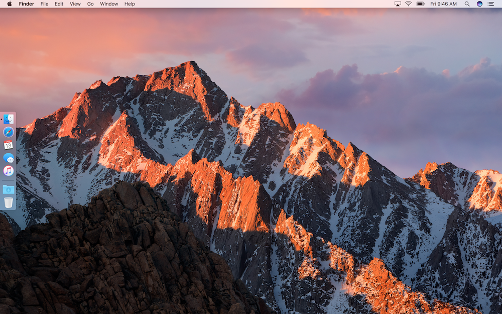

### System

- **General** (appearance: graphite; always show the scroll bars; click to jump to that spot):  
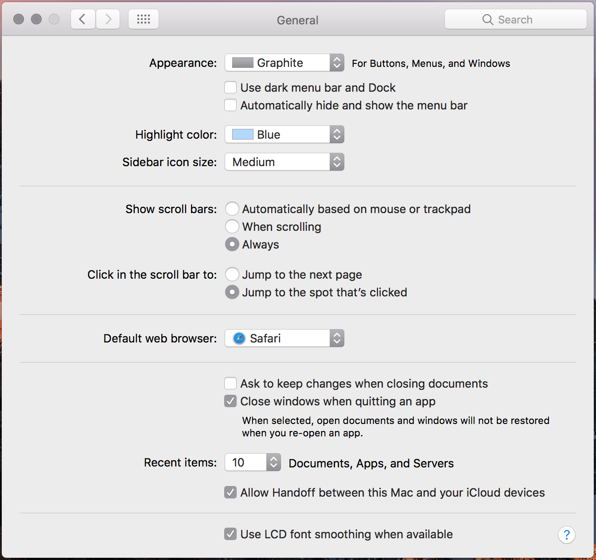

- **desktop & screen saver**:  
	- plain background  
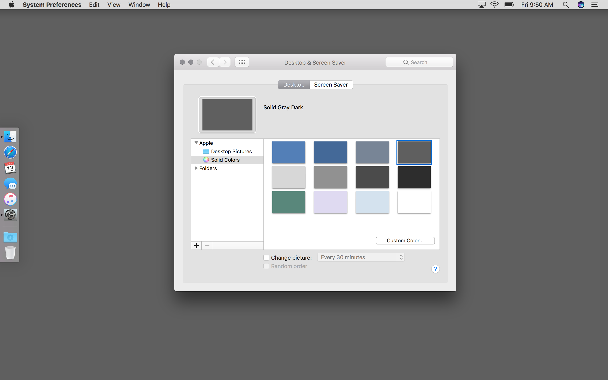  
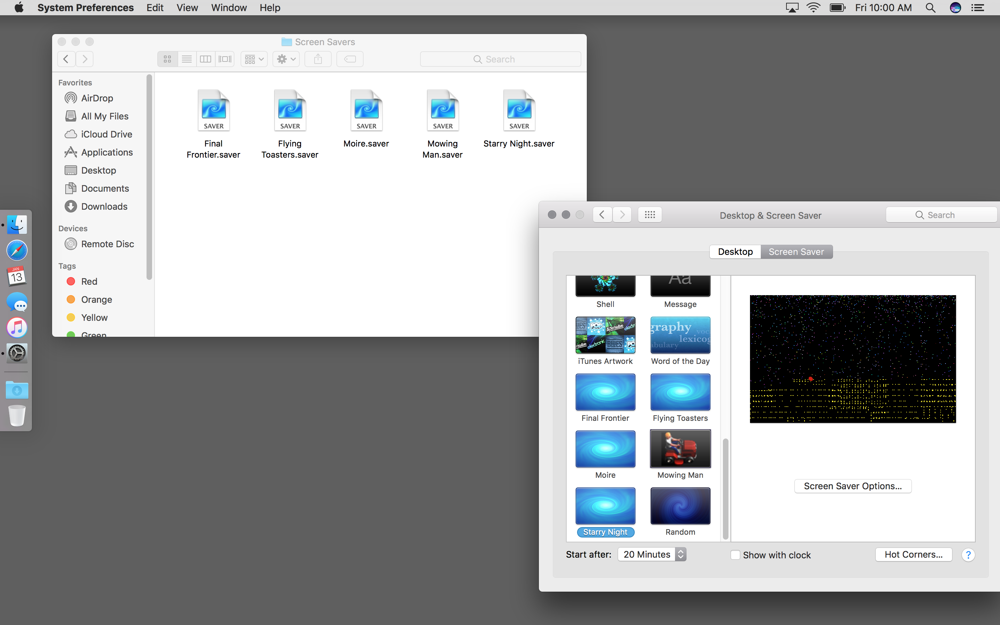  
	- screensaver hotcorner  
  
	- [ported afterdark screen savers](resources/ported-afterdark-screen-savers.zip)
		- final frontier:  
		
		
		- flying toasters:  
		
		
		- moire:  
		
		
		
		- mowing man (*paid*):  
		  
		
		- starry night (*paid*):  
		

- spotlight (turn off lookup):  


- notifications:  
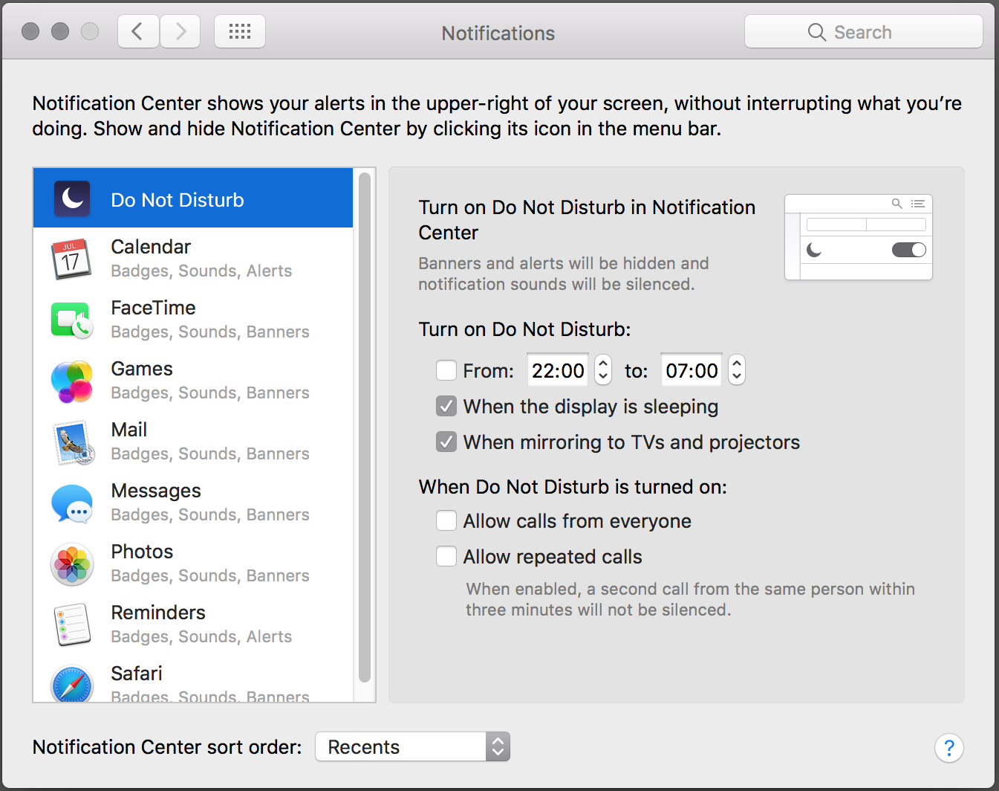

- displays:  
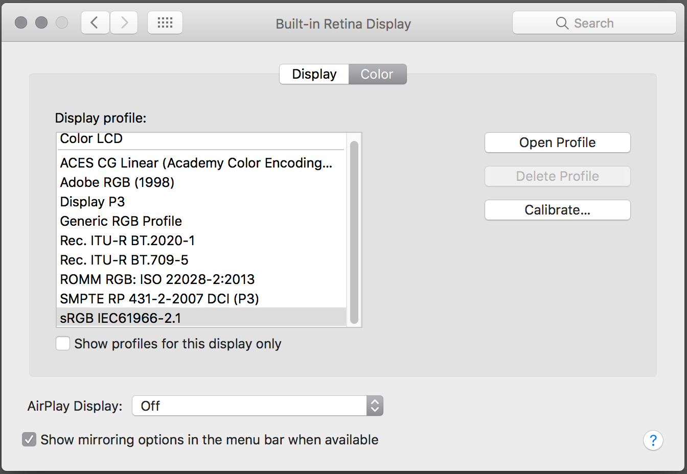

- energy saver:  
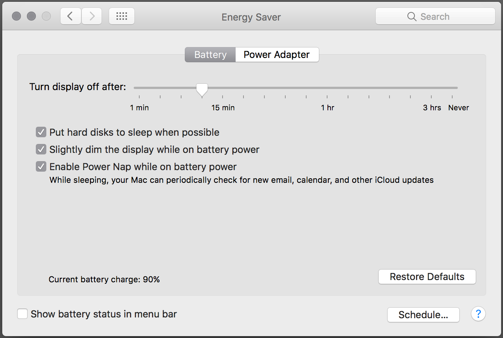

- keyboard:  
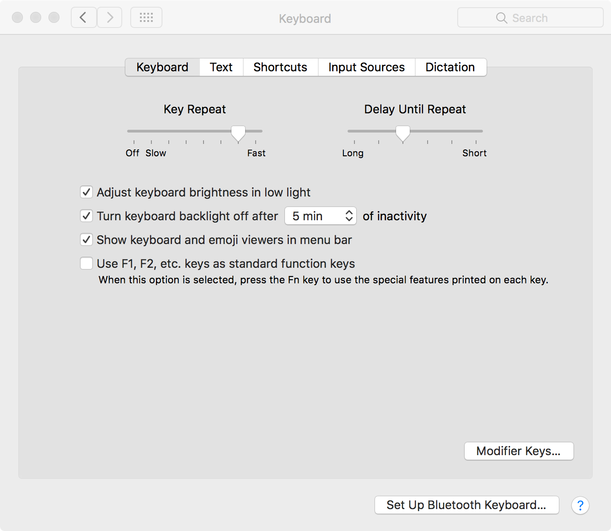


- trackpad:  
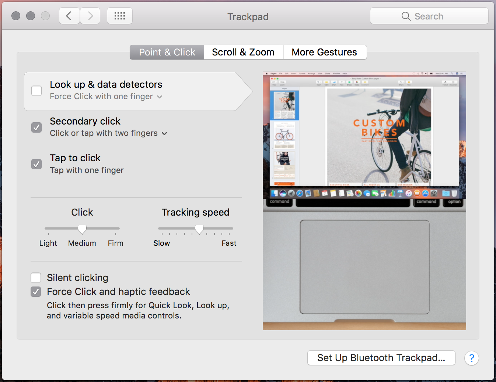
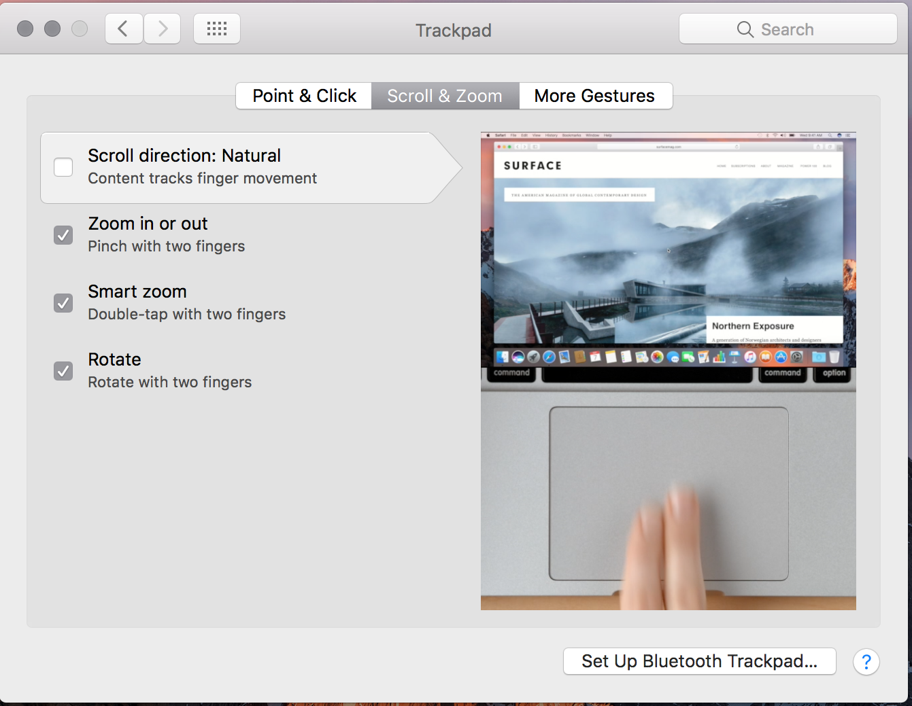
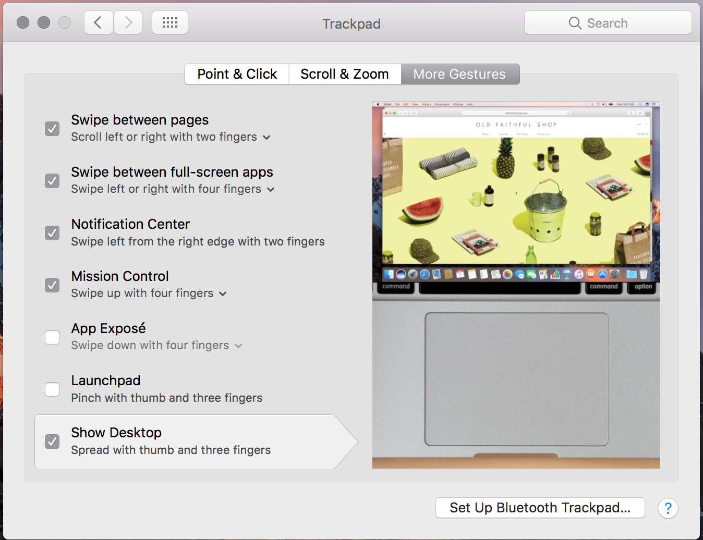

- date & time (assumes Day-O is installed):  


- accessibility:  
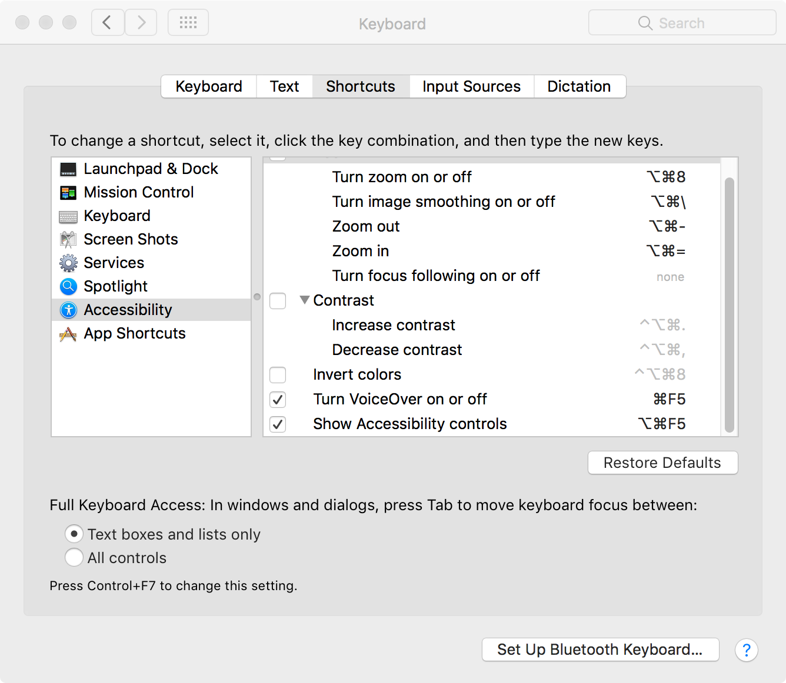


### Finder

- prefs:  


  

- [folder icons](resources/folder-icons-for-dock.zip):  


- view options:  


- toolbar and window bars:  


---

## App preferences

- ####BetterTouchTool:  


- ####CoconutBattery:  


- ####ControlPlane:  
set up automatic VPN on commonly used public networks (e.g. coffee shops, city wifi, etc)
	- in [Script Editor](file:///Applications/Utilities/Script Editor.app), create two new documents and save them as scripts or applications:
		- The connect script:  
		 
			```
			tell application "Tunnelblick"
				connect "US East"
				get state of first configuration where name = "US East"
				repeat until result = "CONNECTED"
					delay 1
					get state of first configuration where name = "US East"
				end repeat
			end tell
			```
		- The disconnect script:  
		
			```
			tell application "Tunnelblick"
				disconnect "US East"
				get state of first configuration where name = "US East"
				repeat until result = "EXITING"
					delay 1
					get state of first configuration where name = "US East"
				end repeat
			end tell
			```	
	- In ControlPlane's preferences: Under "Evidence Sources," add "Nearby WiFi Network"
	- Under "Rules," choose "Add 'Nearby WiFi Network' Rule" > "WiFi SSID," select your target network, and say OK (note: the first time you add a given network you must be connected to it). Set confidence to 100%
	- Under "Actions," add two of "Application Actions" > "Open File or Application"
		- For one, select your VPN connect script/application, the relevant Context, and "On arrival"
		- For the other, select your VPN disconnect script/application, the same Context, and "On departure"

- ####Harvest:  


- ####Isolator:  


- ####SlimBatteryMonitor:  


- ####Spectacle:  


- ####Toggl:  


- ####Wifi Signal:  


- ####XCode (make an alias of Simulator in the Applications folder):  

