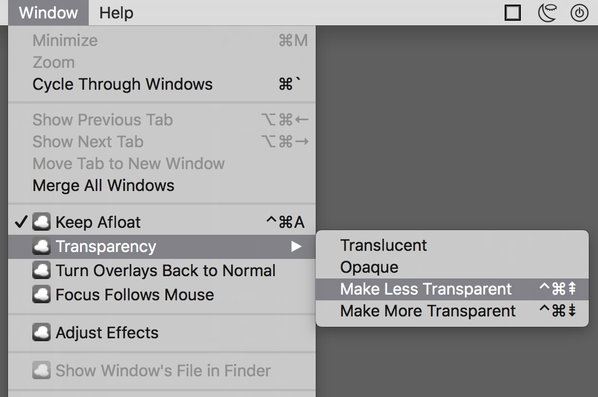
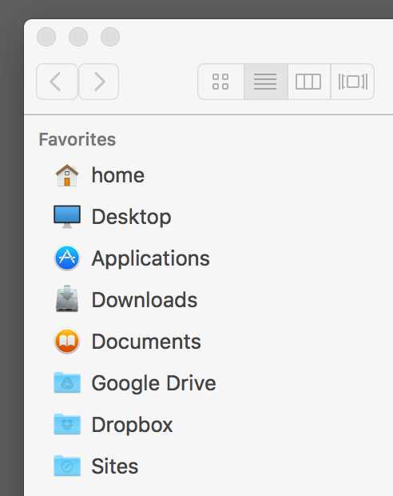
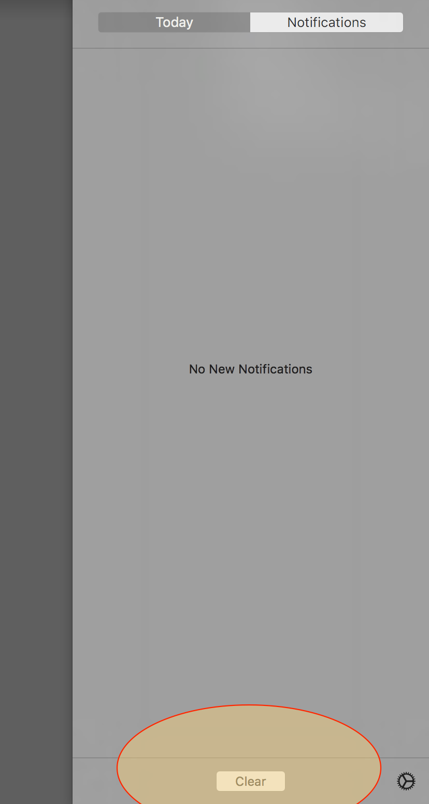

# Setting up a new Mac: app preferences

This file is part of the larger "Setting up a new Mac" project. [See the **main README**](README.md).

- **antiRSI**

	A one-hour schedule

	

- **Bartender**

	This is my menubar
	

	And this is what's hidden by Bartender
	

- **BetterTouchTool**

	
	
	

- **CoconutBattery**

	

- **ControlPlane**

	set up automatic VPN on commonly used public networks (e.g. coffee shops, city wifi, etc)

	- in [Script Editor](file:///Applications/Utilities/Script Editor.app), create two new documents and save them as scripts or applications:

		- The connect script:

			```
			tell application "Tunnelblick"
				connect "US East"
				get state of first configuration where name = "US East"
				repeat until result = "CONNECTED"
					delay 1
					get state of first configuration where name = "US East"
				end repeat
			end tell
			```
		- The disconnect script:

			```
			tell application "Tunnelblick"
				disconnect "US East"
				get state of first configuration where name = "US East"
				repeat until result = "EXITING"
					delay 1
					get state of first configuration where name = "US East"
				end repeat
			end tell
			```
	- In ControlPlane's preferences: Under "Evidence Sources," add "Nearby WiFi Network"
	- Under "Rules," choose "Add 'Nearby WiFi Network' Rule" > "WiFi SSID," select your target network, and say OK (note: the first time you add a given network you must be connected to it). Set confidence to 100%
	- Under "Actions," add two of "Application Actions" > "Open File or Application"
		- For one, select your VPN connect script/application, the relevant Context, and "On arrival"
		- For the other, select your VPN disconnect script/application, the same Context, and "On departure"

- **Gmail**

	- `gear > themes > soft gray`
	- `gear > settings`
		- `> general`
			- `Show "Send & Archive" button in replay`
			- `Enable Undo Send (30 seconds)`
			- Add some additional `stars`
			- `desktop notifications > new mail notifications on`
			- `Keyboard shortcuts on` ([shortcuts cheatsheet](https://shortcutworld.com/en/Gmail/mac/all))
			- `Hide the people widget`
		- `> labs` I enable the following
			- Google Calendar gadget
			- Mark as Read Button
			- Preview Pane
			- Unread message icon (not relevant in a Fluid app, but nice in the browser)
	- Filters for Google Calendar emails:
	- For invitations and updates:

		```
		Subject: invitation
		Has the words: *.ics
		Has attachment √
		```
	- For cancelled events

		```
		Subject: canceled event
		Has the words: *.ics
		Has attachment √
		```

- **Harvest**

	

- **Isolator**

	
	
	
	

- **MySIMBL**

	Install plugins by clicking "Discover"

	

	and go to Wolf's plugins

	

	I add **Afloat**, **cDock**, **colorfulSidebar**, **Notification Clear**.

	You may need to turn off System Integrity Protection (SIP) during installation. mySIMBL should tell you how to do that. It's:

	- Restart the computer while holding down Command R to boot into Recovery Mode
	- Once the computer has started: From the Utilities menu select "Terminal"
	- `csrutil disable; reboot`
	- After installing SIMBL plugins, reenable SIP by booting into recovery mode and running `csrutil enable; reboot`

	1. **Afloat** lets you keep windows on top of others and adjust individual windows' transparency.

		

	1. **cDock** lets you theme the Dock. I use it to completely remove the Dock's background

		<kbd></kbd>

		The result:

		

	1. **colorfulSidebar** colors the sidebar icons. You can customize the icons - here it is with the defaults:

		

	1. **Notification Clear** adds a "clear" button to clear all Notification Center notifications in one click.

		

- **SlimBatteryMonitor**

	

- **Spectacle**

	

- **TinkerTool**

	
	
	
	

- **Toggl**

	

- **Wifi Signal**

	
