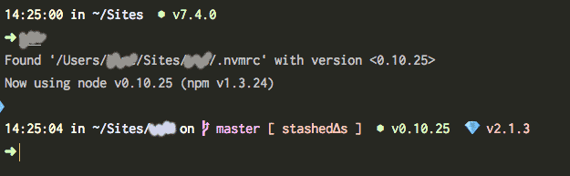

# Setting up a new Mac: the command line

This file is part of the larger "Setting up a new Mac" project. [See the **main README**](README.md).

- First, follow the [documentation](starting-command-line-tools.md) by [ten1seven](https://github.com/ten1seven) and [greypants](https://github.com/greypants) to set up Xcode tools, Homebrew, ruby with rbenv, git and set up github, node with nvm, yarn, mysql + postgres,

- and then

  - after installing postgres, either set it up to automatically run:
    ```
    brew services start postgresql
    ```

    or, if you just want to run it manually, add an alias an alias to the too-long-to-remember command to your shell profile:

    ```
    echo 'alias pgstart="pg_ctl -D /usr/local/var/postgres -l /usr/local/var/postgres/server.log start"' >> ~/.bash_profile
    ```

    (or install zsh, below, and add the alias to your zsh profile by replacing the end of that command with `>> ~/.zrc`)

  - Make [Sublime Text's command line tool](http://www.sublimetext.com/docs/3/osx_command_line.html) available:

    ```
    ln -s "/Applications/Sublime Text.app/Contents/SharedSupport/bin/subl" /usr/local/bin/subl
    ```

  - With `npm` installed, install [`npm-check-updates`](https://github.com/tjunnone/npm-check-updates):

    ```
    npm install -g npm-check-updates
    ```

## Homebrew Packages

Some of the packages I use most are

  - [speedtest-cli](https://github.com/sivel/speedtest-cli) - install via Homebrew with `brew install speedtest-cli`
  - [trash-cli](https://github.com/sindresorhus/trash-cli) - install via Homebrew with `brew install trash-cli`
  - [tree](http://mama.indstate.edu/users/ice/tree/) - install via Homebrew with `brew install tree`

You can install fonts, including some I use in the terminal and in code editors, with Homebrew. This means you'll get any updates to the fonts!

```shell
brew tap caskroom/fonts
```

Then you can `brew search your-font-name`. You can see the full list of font in the [fonts cask repo](https://github.com/caskroom/homebrew-fonts).

```shell
$ brew cask list
betterzipql           font-amiri            qlcolorcode           qlmarkdown            quicklook-csv         touch-bar-simulator   xquartz
caprine               hyper                 qlimagesize           qlstephen             quicklook-json        vienna
```

```shell
$ brew leaves
ansiweather
autoenv
awscli
boost
checkbashisms
josegonzalez/php/composer
coreutils
dash
emacs
exercism
ffmpeg
fish
fzf
git
git-cola
highlight
hub
imagemagick
mackup
mdv
micro
mopidy/mopidy/mopidy
mysql
node
pandoc
josegonzalez/php/php54-mcrypt
josegonzalez/php/php56-mcrypt
josegonzalez/php/php70-mcrypt
josegonzalez/php/php71-mcrypt
postgresql
potrace
qt@5.5
rbenv
sassc
shairport-sync
shellcheck
speedtest-cli
sphinx-doc
terminal-notifier
thefuck
trash
tree
watchman
yarn
youtube-dl
zplug
zsh
zsh-completions
```


## Terminal

I use [**iTerm2**](https://www.iterm2.com/).

For a color scheme (`Preferences > Profiles > (profile of choice) > Colors`), I use a [**custom dark theme** you can get here](resources/olets-iterm-color-scheme.itermcolors). Install by downloading the file and then selecting it in

```
Preferences > Profiles > (profile of choice) > Colors > Color Presets... > Import…
```

For a font (`Preferences > Profiles > (profile of choice) > Colors`) I use **Incosolata-dz for Powerline**, installed via Homebrew (see above).

The result is



## Shell

**zsh** shell + **oh-my-zsh**

Why? Read [this slide deck with some reasons](https://news.ycombinator.com/item?id=5690235), and ["Comparison of command shells"](https://en.wikipedia.org/wiki/Comparison_of_command_shells)

- [Docs for installing ZSH](https://github.com/robbyrussell/oh-my-zsh/wiki/Installing-ZSH) (following the Homebrew instructions is recommended). As of this writing:

  1. Install zsh with

     ```shell
     brew install zsh zsh-completions
     ```

  2. Give your shell setup access to zsh

     ```shell
     sudo nano /etc/shells
     ```

     and add `/usr/local/bin/zsh` to the end of the file, and write out.

  3. Set zsh as the default shell

     ```shell
     chsh -s /usr/local/bin/zsh
     ```

  4. Open a new terminal, and go through the zsh setup

- [Docs for installing oh-my-zsh](https://github.com/robbyrussell/oh-my-zsh)

- If you've made any changes to your `~/.bashrc` file, copy over those lines to your `~/.zshrc` file after you switch

### (oh-my-)zsh setup

  - **oh-my-zsh options** (edit `~/.zshrc`)

    Uncomment `DISABLE_AUTO_TITLE="true"`

  - **oh-my-zsh plugins** (edit `~/.zshrc`)

    ```shell
    plugins=(git emoji colored-man-pages zsh-history-substring-search thefuck zsh-autosuggestions zsh-syntax-highlighting)
    ```

  - **Theme**

    I use [**Spaceship**](https://github.com/denysdovhan/spaceship-zsh-theme)

    - Note that Spaceship requires a font that's been patched for Powerline. View the fonts in [their repo](https://github.com/powerline/fonts), and install via Homebrew (see above for instructions on tapping the fonts cask)

    - **Spaceship options**

        ```shell
        SPACESHIP_GIT_STATUS_INDEX_PREFIX=" [ "
        SPACESHIP_GIT_STATUS_ADDED='added∆s '
        SPACESHIP_GIT_STATUS_MODIFIED='unstaged∆s '
        SPACESHIP_GIT_STATUS_UNTRACKED='untracked∆s '
        SPACESHIP_GIT_STATUS_STASHED='stashed∆s '
        SPACESHIP_GIT_STATUS_BEHIND='behind '
        SPACESHIP_GIT_STATUS_AHEAD='ahead '
        SPACESHIP_TIME_SHOW=true
        SPACESHIP_PACKAGE_SHOW=false
        SPACESHIP_PROMPT_DEFAULT_PREFIX=" "
        SPACESHIP_RUBY_PREFIX=" "
        SPACESHIP_NODE_PREFIX=" "
        SPACESHIP_RUBY_SYMBOL="💎  " # adds an extra space for kerning
        SPACESHIP_EXEC_TIME_SHOW=false
        SPACESHIP_BATTERY_DISCHARGING_SYMBOL="🔌 "
        SPACESHIP_BATTERY_FULL_SYMBOL="🔋 "
        ```

  - **Autoload the correct version of node via nvm**

    Add this script ([source](https://github.com/creationix/nvm#deeper-shell-integration)) to `~/.zshrc` to detect and autorun `.nvmrc` files

    ```shell
    # Audodetect nvmrc files
    autoload -U add-zsh-hook
    load-nvmrc() {
      local node_version="$(nvm version)"
      local nvmrc_path="$(nvm_find_nvmrc)"
    	
      if [ -n "$nvmrc_path" ]; then
        local nvmrc_node_version=$(nvm version "$(cat "${nvmrc_path}")")
    	
        if [ "$nvmrc_node_version" != "N/A" ] && [ "$nvmrc_node_version" != "$node_version" ]; then
          nvm install
        fi
      elif [ "$node_version" != "$(nvm version default)" ]; then
        echo "Reverting to nvm default version"
        nvm use default
      fi
    }
    add-zsh-hook chpwd load-nvmrc
    load-nvmrc
    ```

  - **A custom terminal window title:**

    ```shell
    # custom window title
    # this will show "cwd (process)"
    set-window-title() {
      window_title="\033]0;${PWD##*/}\007"
      echo -ne "$window_title"
    }
    PR_TITLEBAR=''
    set-window-title
    add-zsh-hook precmd set-window-title
    ```
  - **Some of my most-used aliases**

    ```shell
    # Copies the contents of the id_rsa.pub file to the clipboard
    alias ssh-copy='pbcopy < ~/.ssh/id_rsa.pub'

    # Starts the postgres database
    alias pgstart='pg_ctl -D /usr/local/var/postgres -l /usr/local/var/postgres/server.log start'

    # Lists globally installed npm packages
    alias npmls="npm list -g --depth 0"

    # Open this file in Sublime
    # (requires exposing Sublim - see above)
    alias zrc="subl ~/.zshrc"

    # Have `man` additionally load gem man pages
    alias man="gem man -ls"
    ```

- [Add suggestions with **zsh-autosuggestions**](https://github.com/zsh-users/zsh-autosuggestions)

- [Add fuzzy searching with **fzf**](https://github.com/junegunn/fzf#using-homebrew-or-linuxbrew)


## Git

Extend `git`'s powers with [**hub**](https://hub.github.com/)

```shell
brew install hub
```

And make adjustments to your `~/.gitconfig`

The following aliases are from [@thoughtbot's dotfiles](https://github.com/thoughtbot/dotfiles/blob/master/gitconfig)

```dot
[alias]
  aa = add --all
  ap = add --patch
  branches = for-each-ref --sort=-committerdate --format=\"%(color:blue)%(authordate:relative)\t%(color:red)%(authorname)\t%(color:white)%(color:bold)%(refname:short)\" refs/remotes
  ci = commit -v
  co = checkout
  pf = push --force-with-lease
  st = status
```

My starting git aliases are (n.b: all aliases go under a single `[alias]` section)

```shell
[alias]
  # requires aliasing git to hub
  pr = pull-request

  # dotfiles-like
  cb = checkout -b
  pushforce = push --force-with-lease

  # rebase
  ri = rebase -i
  ro = rebase --onto

  # abort
  cpa = cherry-pick --abort
  ma = merge --abort
  ra = rebase --abort

  # continue
  cpc = cherry-pick --continue
  rc = rebase --continue
```

There's plenty of room to get more complex with git aliases. A good place to start is a command for the first push:

```shell
[alias]
  # the name of the checked out branch
  current = symbolic-ref --short HEAD
  # when pushing for the first time: set upstream and push
  pushset = !git push --set-upstream origin $(git current)
```

As with any time you use aliases, it's worthwhile to take whatever steps will help you to not forget the full command. For simple shorthands like `rc` I'll mix it up with `rebase --continue`, to keep that muscle memory strong. (I don't do this for more complex things. I use `pushset` all the time.)

I also use

```shell
[merge]
  # override with --no-ff
  ff = only
  
[commit]
  template = ~/.gitmessage
  
[fetch]
  prune = true
  
[rebase]
  # override with --no-autosquash
  autosquash = true
```

 (documentation:

- [`merge --ff-only`](https://git-scm.com/docs/git-merge#git-merge---ff-only)
- [`fetch --prune`](https://git-scm.com/docs/git-fetch#git-fetch---prune)
- [`rebase --interactive --autosquash`](https://git-scm.com/docs/git-rebase#git-rebase---autosquash)

)

with a GitHub-friendly default commit message inspired by [thoughtbot's dotfiles'](https://github.com/thoughtbot/dotfiles/blob/master/gitmessage):

```shell


# 50-character subject line
# 72-character wrapped longer description
```

(Note there are a couple of leading blank lines in that commit message file. As of this writing they don't show up in GitHub's rendered Markdown.)

